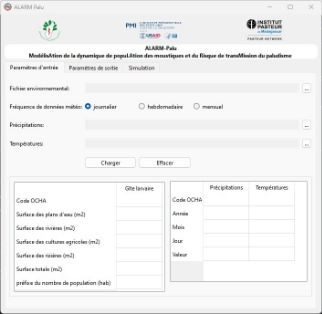
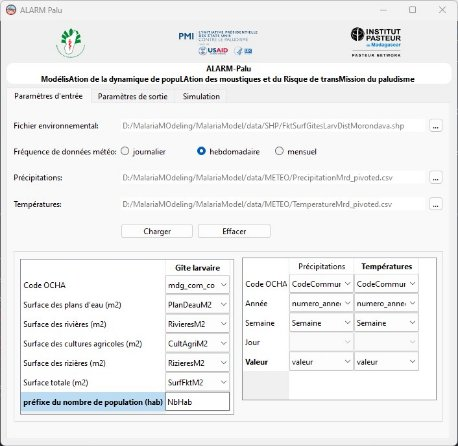
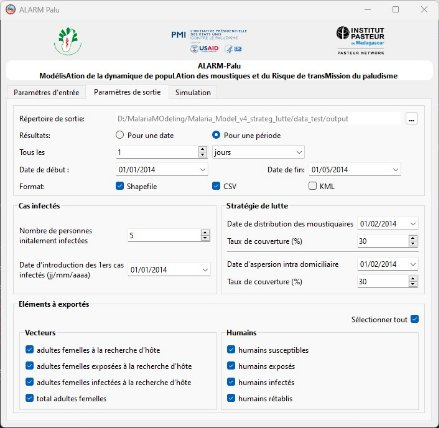
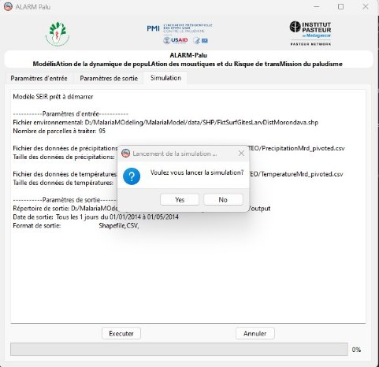
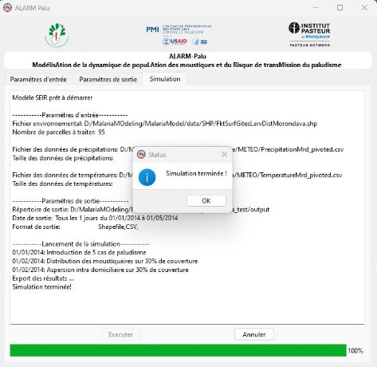
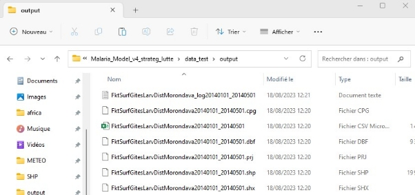
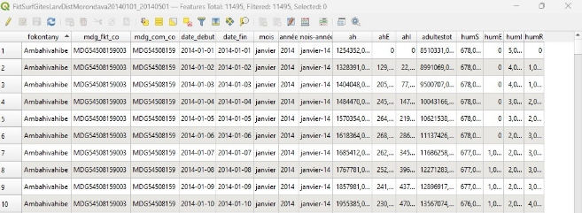



# Sommaire
[**1.**	**A propos**	1](#_toc142922156)

[**2.**	**Etapes du lancement du modèle**	1](#_toc142922157)

[Etape 1 : Paramètres d’entrée	2](#_toc142922158)

[Etape 2 : Paramètres de sortie	3](#_toc142922159)

[Etape 3 : Simulation	4](#_toc142922160)

[**3.**	**Résultat de la simulation**	6](#_toc142922161)

[Description des champs	7](#_toc142922162)

1. ## **A propos**
L’outil de Modélisation de la dynamique de population des moustiques et du risque de transmission du paludisme (ALARM Palu) permet d’évaluer la population des moustiques et du risque de paludisme sur une zone donnée.

Cette version exécutable sous le système d’exploitation Windows.

Le présent manuel illustre un traitement complet de l’outil.
1. ##  **Etapes du lancement du modèle**
Pour lancer l’outil, cliquer sur le fichier d’exécution “ALARM Palu”.

L’outil se compose de 3 étapes divisées en 3 onglets :

1. **Les paramètres d’entrée** permettant d’importer les données environnementales et les données de précipitations et de températures
1. **Les paramètres de sortie** permettant de choisir les résultats à exporter ainsi que le format du fichier à exporter
1. **La simulation** permettant de lancer le modèle

### Etape 1 : Paramètres d’entrée
Sous l’onglet paramètres d’entrée, l’utilisateur devrait choisir les 3 fichiers suivants :

- **Fichier environnemental** contenant les données d’occupation du sol ou gite larvaire (lieu, surface des plans d’eau, surface des rizières, etc.)
- **Précipitations** contenant les données de précipitations des zones d’étude dans une période données
- **Températures** contenant les données de températures des zones d’étude dans une période données

**NB :** les données d’entrée devraient suivre les conditions ci-dessous

<table><tr><th colspan="1" valign="top"><b>Fichier</b></th><th colspan="1" valign="top"><b>Format</b></th><th colspan="1" valign="top"><b>Minimum des champs (colonnes) requises</b></th></tr>
<tr><td colspan="1" valign="top">Fichier environnemental</td><td colspan="1" valign="top">shp</td><td colspan="1" valign="top">
Code Commune (champ de jointure avec le tableau à droite)

Surface des plans d’eau (m2)

Surface des rivières (m2)

Surface des cultures agricoles (m2)

Surface des rizières (m2)

Surface totale (m2)

Préfixe du nombre de population (hab) par année
</td></tr>
<tr><td colspan="1" valign="top">Précipitations</td><td colspan="1" rowspan="2" valign="top">csv</td><td colspan="1" rowspan="2" valign="top">
Commune

Année

Mois (ou Semaine si données hebdomadaires)

Jour (si données journalières)

Valeur (en mm si précipitation, en °C si température)
</td></tr>
<tr><td colspan="1" valign="top">Températures</td></tr>
</table>

Après avoir chargé les fichiers d’entrée, l’utilisateur devrait choisir les colonnes correspondantes à chaque ligne du tableau du dessous.

Si les valeurs des colonnes choisis sont valides (c’est-à-dire de type numérique sauf les codes des Communes et le préfixe du nombre de population), alors l’utilisateur peut passer à l’étape suivante « Paramètres de sortie ». Sinon, un message d’erreur s’affiche.
###  Etape 2 : Paramètres de sortie
Sous l’onglet paramètres de sortie, l’utilisateur devrait choisir les éléments suivants :

- **Le répertoire de sortie :** Le nom du fichier de sortie est comme-suit :

[Nom\_fichier\_environnemental]\_[date\_debut\_sortie]\_[date\_fin\_sortie]

- **Les dates de sortie :** soit pour une seule date soit pour une période donnée
  - Si pour une date, alors l’utilisateur devrait choisir la date de la fin de sortie. La date du début des sorties est définie 7 avant la date de fin des sorties
  - Si pour une période, l’utilisateur devrait choisir la date du début et celle de fin ainsi que la fréquence des sorties (tous les n jours ou tous les n mois)
- **Le format de sortie :** sous format shapefile et/ou csv et/ou kml
- **La date et le nombre de personnes initialement infectées :**
  - la date se situe entre la date de début de simulation et la date de fin de sortie
  - Le nombre de personnes initialement infectées varie** entre 0 et le nombre maximal de population de l’année du début de la simulation
- **La date et le taux de couverture de distribution des moustiquaires :**
  - la date se situe entre la date de début de simulation et la date de fin de sortie
  - le taux est** entre 0 à 100 %
- **La date et le taux de couverture d’aspersion intra domiciliaire :**
  - la date se situe entre la date de début de simulation et la date de fin de sortie
  - le taux est** entre 0 à 100 %
- **Les valeurs à exporter :** l’utilisateur devrait choisir au moins un des valeurs à exportés listés en bas de l’onglet (moustiques, humain, capacité de charge)

Si les valeurs choisis sont valides, alors l’utilisateur peut passer à l’onglet suivant « Simulation ». Sinon, un message d’erreur s’affiche.

` `
### Etape 3 : Simulation
Sous l’onglet « Simulation », l’outil résume les paramètres d’entrée et les paramètres de sortie choisis par l’utilisateur.

Pour lancer le modèle, l’utilisateur devrait cliquer sur le bouton « Exécuter » en bas. Une boîte de dialogue apparaît ensuite pour confirmer la réponse de l’utilisateur.

Une fois la simulation lancée, l’outil calcule les valeurs à exportées puis exporte les résultats selon les formats de fichier et la fréquence de sortie choisis par l’utilisateur.

Si les paramètres KL ou les données de température ou de précipitation sont de valeurs nulles, alors les valeurs des résultats correspondantes seront nulles.

L’utilisateur peut annuler la simulation en cliquant sur le bouton « Annuler ». Sinon, une boîte de dialogue s’affiche lorsque la simulation est terminée.

1. ## **Résultat de la simulation**
Les résultats de la simulation sont sauvegardés dans le répertoire de sortie choisit par l’utilisateur dans l’onglet « Paramètres de sortie ». L’historique du paramétrage et de la simulation y sont stocké également au format texte (.txt).

### Description des champs
Les noms des champs correspondent aux descriptions suivantes :

|**Nom**|**Description** |
| :- | :- |
|adultestot|Nombre total des moustiques adultes femelles|
|ah|Nombre des moustiques adultes femelles à la recherche d'hôte|
|ahE|Nombre des moustiques adultes femelles exposées à la recherche d'hôte|
|ahI|Nombre des moustiques adultes femelles infectées à la recherche d'hôte|
|humS|Nombre des humains susceptibles|
|humE|Nombre des humains exposés|
|humI|Nombre des humains infectés|
|humR|Nombre des humains rétablis|

Toutes les valeurs numériques exportés sont arrondies à des valeurs en entiers.

Les formats des dates sont transcrits en français

Page 7 sur 7
